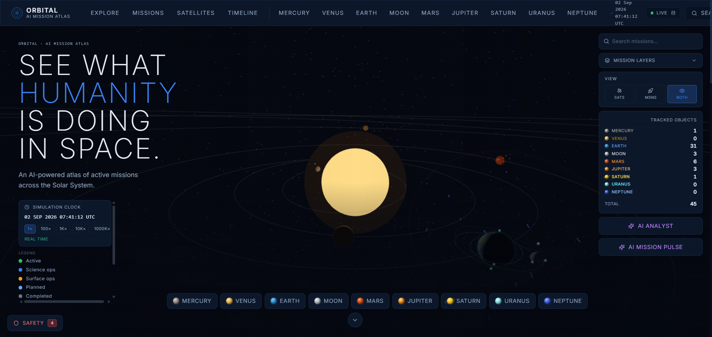

# ORBITAL — AI Mission Atlas

> **"See what humanity is doing in space."**



An AI-powered interactive catalog of active human space missions across Earth, Moon, Mars, and the wider solar system, built for the IBM Bob AI Challenge.

---

## Problem Statement

Publicly available space-mission data is scattered across dozens of agency websites, API endpoints, and technical documents. There is no single, accessible interface where a curious non-expert can:

- See all active missions at a glance on a shared map
- Understand what a spacecraft is doing *right now*, and why it matters
- Ask plain-language questions about mission status, objectives, or risk
- Trust that what they are reading is clearly labeled as observed, derived, or estimated

ORBITAL addresses this gap by aggregating real public data from NASA, CelesTrak, ESA, and SatNOGS into a single interactive platform, and layering a transparent AI analyst on top.

---

## Solution Description

ORBITAL is a Next.js web application that provides:

1. **A live 3D solar system map** — full heliocentric scene (Sun through Neptune) with planets, moons, and every tracked spacecraft rendered at physically-grounded orbital positions derived from published Keplerian elements.
2. **A mission catalog** — 31 real missions seeded with data from authoritative public sources, covering Earth, Moon, Mars, Jupiter, Saturn, Uranus, Mercury, Venus, and Neptune; fully filterable by destination, agency, and type.
3. **A Satellite Explorer** — live orbital tracking of specific Earth satellites (ISS, Terra, Aqua, Landsat 9, NOAA-20, NOAA-18, GOES-16) using real-time CelesTrak GP data, with ground-track maps and AI-powered orbital explanations.
4. **An AI Space Analyst** — a conversational interface that can answer questions about any mission or satellite in context, powered by a provider-agnostic AI backend (mock, IBM watsonx/Granite, or Google Gemini).
5. **An Orbital Safety Monitor** — a real-time conjunction risk HUD that evaluates every tracked spacecraft pair using a deterministic, explainable risk engine, with AI-assisted interpretation on demand.
6. **Transparent data provenance** — every data point is labeled `OBSERVED`, `DERIVED`, `AI`, or `ESTIMATED` so users always know what they are reading.

---

## AI Approach and Architecture

### Provider-Agnostic AI Layer (`lib/ai.ts`)

The AI capability is fully decoupled from any single provider through a simple interface:

```typescript
export interface AIProvider {
  generateResponse(
    messages: AIMessage[],
    context: AIContext,
    systemPrompt: string
  ): Promise<string>;
}
```

A factory function reads `AI_PROVIDER` at startup and returns the appropriate implementation. Three providers are implemented:

| `AI_PROVIDER` | Implementation | Notes |
|---|---|---|
| `mock` *(default)* | `MockAIProvider` | Deterministic keyword-matched responses. No external calls. Works offline. |
| `gemini` | `GeminiProvider` | Google Gemini REST API (free tier). Requires `GEMINI_API_KEY`. No fallback to mock — misconfiguration surfaces as an explicit error. |
| `watsonx` | `WatsonxProvider` | IBM watsonx.ai `/ml/v1/text/chat` using IAM bearer-token auth. Falls back to mock if credentials are missing. |

Adding a further provider requires only implementing the `AIProvider` interface and adding a `case` to `createProvider()`.

### Context Injection

Before every AI call the application builds a structured context block from live application state. Three context types are supported:

- **Mission context** (`buildMissionContext`) — selected mission name, agency, status, current phase, location, spacecraft, recent events, and curated AI insights
- **Satellite context** (`buildSatelliteContext` / `buildGeminiContext`) — live orbital state fetched from CelesTrak: altitude, velocity, period, inclination, position (all `DERIVED`), raw inclination (`OBSERVED`), SatNOGS observation availability, and anomaly flags from deterministic threshold checks
- **Risk context** (`buildRiskContext`) — for the Orbital Safety Monitor, pre-computed scores (OCS, TRS, composite), kinematic values, and TCA data are injected verbatim so the model never recalculates them

### System Prompt (`SYSTEM_PROMPT` in `lib/ai.ts`)

The system prompt defines two operating modes:

1. **Mission analyst mode** — instructs the model to treat injected mission-context data as ground truth, use general knowledge only for broader space questions, clearly distinguish `OBSERVED` / `DERIVED` / `AI` data, and never invent telemetry values.
2. **Risk analyst mode** — an extended set of strict grounding rules that govern how the model must interpret and phrase orbital risk scores. Scores are defined as dimensionless 0–100 indices, never percentages or collision probabilities. The model is prohibited from recalculating, adjusting, or contradicting pre-computed scores.

### IBM watsonx / Granite

When `AI_PROVIDER=watsonx`, ORBITAL uses the IBM watsonx.ai chat completions API with:
- IAM token exchange (server-side only — the API key is never exposed to the browser; tokens are cached in-memory with a 60-second refresh margin)
- Conservative inference parameters (`temperature: 0.2`, `max_new_tokens: 1024`, `repetition_penalty: 1.05`) chosen to produce grounded, factual responses
- Any configured IBM Granite model (e.g. `ibm/granite-3-8b-instruct`, `ibm/granite-4-h-small`)

> **Note:** The application runs fully in `mock` mode by default. watsonx integration is activated only when the four required environment variables are set (`AI_API_KEY`, `WATSONX_PROJECT_ID`, `WATSONX_URL`, `WATSONX_MODEL_ID`).

### Google Gemini (free tier)

When `AI_PROVIDER=gemini`, ORBITAL uses the Google Gemini REST API (`generativelanguage.googleapis.com`) with:
- A single `GEMINI_API_KEY` (server-side only — never a `NEXT_PUBLIC_` variable)
- Model configurable via `GEMINI_MODEL` (default: `gemini-3.5-flash`)
- `thinkingBudget: 0` to disable Gemini's chain-of-thought reasoning, keeping the full token budget for the visible answer
- Rate-limit (HTTP 429) errors surface as user-facing messages rather than silent failures

### Deterministic Risk Engine (`lib/risk.ts`)

The Orbital Safety Monitor does not rely on AI for its scores. All risk calculations are computed server-side by a deterministic engine:

- **Orbital Compatibility Score (OCS)** — geometric similarity index based on altitude shell overlap, inclination difference, and instantaneous angular proximity
- **Trajectory Risk Score (TRS)** — constant-velocity TCA (Time of Closest Approach) analysis with miss-distance prediction
- **Composite score** — `0.65 × TRS + 0.35 × OCS` when a valid TCA exists; OCS-only fallback otherwise

The AI is only involved in *interpreting* these pre-computed scores in plain language, with strict prompt rules preventing misrepresentation.

### AI Data Flow

The key design principle of ORBITAL is that **AI is never in the critical path of any calculation**. Here is how data flows through the system:

1. **Data ingestion** — Mission data is seeded from public sources (NASA, CelesTrak, ESA, SatNOGS, JPL) in [`lib/missions.ts`](./lib/missions.ts) and [`lib/services.ts`](./lib/services.ts). Every value carries a provenance label (`OBSERVED`, `DERIVED`, `ESTIMATED`).

2. **Orbital propagation** — [`lib/orbital-mechanics.ts`](./lib/orbital-mechanics.ts) uses published Keplerian elements to compute spacecraft positions via simplified two-body propagation. [`lib/telemetry.ts`](./lib/telemetry.ts) wraps this into a deterministic, side-effect-free snapshot at any simulation time `t`. For the Satellite Explorer, [`lib/satellites/celestrak.ts`](./lib/satellites/celestrak.ts) fetches live GP records directly from CelesTrak (with a 2-hour in-memory TTL cache), and [`lib/satellites/orbital-state.ts`](./lib/satellites/orbital-state.ts) derives the human-facing orbital quantities from them.

3. **Risk scoring (deterministic, no AI)** — [`lib/risk.ts`](./lib/risk.ts) consumes the telemetry snapshot and computes OCS, TRS, and composite scores for every tracked spacecraft pair. These are pure mathematical indices — no model inference, no network calls, no randomness. The `/api/risk` route serves these scores to the frontend.

4. **Context injection** — When the user opens the AI Analyst, the application builds a structured text block from live state. For satellite queries, CelesTrak-derived orbital values are injected verbatim (`buildSatelliteContext` / `buildGeminiContext`) along with `SATELLITE_GROUNDING_ADDENDUM` rules. For risk queries, pre-computed scores and kinematic values are injected verbatim using `buildRiskContext()`. In all cases the model receives pre-computed facts, not raw numbers to interpret independently.

5. **System prompt grounding** — The `SYSTEM_PROMPT`, `RISK_GROUNDING_ADDENDUM`, and `SATELLITE_GROUNDING_ADDENDUM` define strict behavioral rules: risk scores must be written as `X/100`, never as percentages or probabilities; satellite values must not be invented or re-derived; the model must not recalculate or contradict pre-computed values.

6. **AI response** — The assembled messages, injected context, and system prompt are sent to the configured AI provider (`MockAIProvider` by default; `GeminiProvider` or `WatsonxProvider` when configured). The model's role is solely to translate pre-computed, labeled data into plain language for the user.

7. **Frontend display** — Every AI response is displayed alongside its context and provenance labels. The `DataProvenance` component ensures users can always distinguish `AI`-labeled output from `OBSERVED` data.

> **Summary:** The deterministic risk engine (`lib/risk.ts`) and the CelesTrak fetch pipeline (`lib/satellites/`) own all calculations. The AI model only interprets and explains results it receives — it never computes, adjusts, or contradicts them.

---

## Selected Challenge Theme

**August 2026 — Advancing Space Exploration with AI**

ORBITAL addresses this theme by combining AI-powered mission analysis with interactive space visualization and explainable orbital safety analysis, helping users understand human space missions, spacecraft activity, and potential orbital risks.

---

## How IBM Bob Was Used

IBM Bob (the AI coding assistant) was used throughout the development of ORBITAL as an interactive engineering partner:

- **Architecture review** — discussing the provider-agnostic AI layer design and the separation between the risk engine, telemetry engine, and AI interpretation layer
- **README documentation** — the current README was produced with Bob's assistance, ensuring it accurately reflects the codebase rather than speculating about features
- **Code navigation** — using Bob to explore large files such as [`lib/ai.ts`](./lib/ai.ts) and [`app/api/risk/route.ts`](./app/api/risk/route.ts) to understand and cross-reference implementation details
- **Prompt engineering guidance** — discussing the structure of the `SYSTEM_PROMPT` and `RISK_GROUNDING_ADDENDUM` to ensure the AI analyst behaves safely around risk scores

---

## Quick Start

```bash
git clone <repo-url>
cd orbital
npm install
npm run dev
```

Open [http://localhost:3000](http://localhost:3000).

The application runs fully offline in `AI_PROVIDER=mock` mode by default — no API keys are required to explore the interface.

---

## Features

| Feature | Description |
|---|---|
| **Interactive 3D Solar System** | Full heliocentric scene (Sun → Neptune) with planets, moons, and mission spacecraft driven by JPL Keplerian orbital mechanics |
| **Mission Catalog** | 31 real missions spanning Earth, Moon, Mars, Jupiter, Saturn, Uranus, Mercury, Venus, and Neptune — filterable by destination and type |
| **Satellite Explorer** | Live orbital tracking of 7 Earth satellites using real-time CelesTrak GP data; ground-track map, orbital HUD, and AI-powered orbital explanations |
| **AI Space Analyst** | Conversational interface scoped to the selected mission, satellite, or planet context; powered by the provider-agnostic AI layer |
| **Orbital Safety Monitor** | Real-time conjunction risk HUD; evaluates all tracked spacecraft pairs every 5 seconds using the deterministic risk engine |
| **Mission Pulse** | At-a-glance global status panel for Earth, Moon, and Mars |
| **Mission Timeline** | Chronological view of all mission events across the fleet |
| **Global Search** | Search by mission name, spacecraft, agency, or NORAD ID |
| **Data Provenance** | Every data point labeled `OBSERVED` / `DERIVED` / `AI` / `ESTIMATED` |

---

## Missions Included

31 missions across the solar system, seeded with real public data.

| Destination | Missions |
|---|---|
| **Earth** | ISS, Terra, Aqua, Landsat 9 |
| **Moon** | Artemis II, Lunar Reconnaissance Orbiter (LRO), KPLO/Danuri, Lunar Gateway |
| **Mars** | Perseverance, Curiosity, MAVEN, Mars Reconnaissance Orbiter (MRO), Mars Express, ExoMars TGO, InSight *(completed)* |
| **Jupiter** | Juno *(extended mission)*, Europa Clipper *(cruise)*, JUICE *(cruise)*, Galileo *(completed)* |
| **Saturn** | Cassini *(completed)*, Dragonfly *(planned)* |
| **Uranus** | Voyager 2 – Uranus Flyby *(completed)* |
| **Mercury** | MESSENGER *(completed)*, BepiColombo *(cruise)* |
| **Venus** | Akatsuki, Magellan *(completed)*, Venus Express *(completed)*, DAVINCI *(planned)*, VERITAS *(planned)*, EnVision *(planned)* |
| **Neptune** | Voyager 2 – Neptune Flyby *(completed)* |

---

## Data Sources

| Source | Used For |
|---|---|
| [NASA](https://api.nasa.gov) | Mission data, imagery, rover photos |
| [CelesTrak](https://celestrak.org) | Orbital elements, NORAD IDs, TLE data |
| [SatNOGS](https://db.satnogs.org) | Transmitter data, signal observations |
| [ESA](https://www.esa.int) | European mission data |
| JPL/Caltech | Approximate Keplerian elements for planetary orbits (1800–2050) |

---

## Data Integrity

All data is labeled with its provenance:

| Label | Meaning |
|---|---|
| `OBSERVED` | Directly sourced from a public, authoritative dataset |
| `DERIVED` | Mathematically calculated from observed data (e.g. orbital period from TLE) |
| `AI` | Generated by the AI layer from available context or general knowledge |
| `ESTIMATED` | Approximate value based on mission parameters or simplified models |

**ORBITAL does not fabricate telemetry, spacecraft health data, or real-time positions.**  
All risk scores are dimensionless indices, not collision probabilities. Positions are derived from simplified Keplerian propagation — not SGP4. See [`lib/risk.ts`](./lib/risk.ts) and [`lib/orbital-mechanics.ts`](./lib/orbital-mechanics.ts) for full disclaimers.

---

## Stack

| Layer | Technology |
|---|---|
| **Framework** | Next.js 15 (App Router) + React + TypeScript |
| **Styling** | Tailwind CSS |
| **3D Visualization** | Three.js (raw, no wrapper library) |
| **Charts** | Recharts |
| **AI** | Provider-agnostic abstraction — `mock` by default; `watsonx` (IBM Granite) and `gemini` (Google Gemini) supported |
| **Icons** | Lucide React |

---

## Environment Variables

Copy [`.env.example`](./.env.example) to `.env.local` and fill in the values you need.

```env
# NASA API — free key at api.nasa.gov (DEMO_KEY works for local dev)
NASA_API_KEY=DEMO_KEY

# Database — optional for v1
DATABASE_URL=

# AI provider — mock | gemini | watsonx (default: mock)
AI_PROVIDER=mock

# Required when AI_PROVIDER=gemini (Google AI Studio — free tier)
GEMINI_API_KEY=                     # Get free key at https://aistudio.google.com/
GEMINI_MODEL=gemini-3.5-flash       # Override default model if needed

# Required when AI_PROVIDER=watsonx
AI_API_KEY=                         # IBM Cloud API key (server-side only)
WATSONX_PROJECT_ID=                 # watsonx.ai project ID
WATSONX_URL=https://eu-de.ml.cloud.ibm.com   # Regional endpoint
WATSONX_MODEL_ID=ibm/granite-4-h-small       # Granite model ID

# App
NEXT_PUBLIC_APP_URL=http://localhost:3000
```

> **Security note:** All AI provider keys are used server-side only. Never prefix any key with `NEXT_PUBLIC_` and never expose credentials to the browser.

---

## Demo Flow

1. Open ORBITAL → The heliocentric solar system loads with all planets and active mission markers
2. Click **EARTH** → Camera transitions to Earth context; mission list filters to Earth missions; Satellite Explorer panel opens showing live ISS, Terra, Aqua, and Landsat 9 tracks
3. Select a satellite (e.g. **ISS**) → Ground-track map, live orbital HUD, and AI-powered orbital explanation ("How fast is it going?")
4. Click **MOON** → Transitions to lunar context; shows Artemis II, LRO, KPLO, Gateway
5. Select **ARTEMIS II** → Mission detail page: phases, spacecraft specs, AI-generated brief
6. Click **AI ANALYST** → Ask *"What is Artemis II doing?"* — response is scoped to mission context
7. Navigate to **MARS** → Select **PERSEVERANCE** → Rover imagery + event timeline
8. Ask *"What has Perseverance been doing recently?"*
9. Return to home → Open the **Orbital Safety Monitor** (shield icon) → See live conjunction risk scores with risk-level breakdowns
10. Click **Analyze with AI** on a risk entry → AI interprets the pre-computed scores with full disclaimer

---

## Architecture

```
orbital/
├── app/                              # Next.js App Router
│   ├── layout.tsx, globals.css, not-found.tsx
│   ├── page.tsx                       # Home: 3D scene, mission UI, satellite HUDs, AI and risk panels
│   ├── missions/                      # /missions and /missions/[id]
│   ├── satellites/                    # /satellites and /satellites/[id], both redirect into Earth mode
│   ├── timeline/                      # /timeline
│   └── api/
│       ├── ai/route.ts                # POST /api/ai
│       ├── missions/route.ts          # GET /api/missions; GET /api/missions/[id]
│       ├── pulse/route.ts             # GET /api/pulse
│       ├── risk/route.ts              # GET /api/risk
│       ├── search/route.ts            # GET /api/search
│       └── satellites/route.ts        # GET /api/satellites, /fleet, and /[id]
├── components/
│   ├── SpaceScene.tsx                 # Three.js solar-system scene
│   ├── AIAnalyst.tsx, RiskHUD.tsx     # AI and conjunction-risk panels
│   ├── MissionCatalog.tsx, MissionCard.tsx, MissionDetail.tsx
│   ├── MissionPulse.tsx, MissionTimeline.tsx
│   ├── Navigation.tsx, NavigationWrapper.tsx, PlanetIcon.tsx, DataProvenance.tsx
│   └── satellites/                    # Earth telemetry, satellite detail, and ground-track UI
├── lib/
│   ├── missions.ts, types.ts          # Mission data and shared types
│   ├── ai.ts, services.ts             # AI integration and application services
│   ├── telemetry.ts, risk.ts          # Orbital snapshots and risk calculations
│   ├── orbital-mechanics.ts, solar-system.ts
│   ├── spacecraft-positions.ts, spacecraft-geometry.ts, earth-texture.ts
│   └── satellites/                    # Catalog, CelesTrak access, orbital state, fleet, and scene helpers
├── package.json                       # Next.js scripts and dependencies
└── next.config.js, tsconfig.json, tailwind.config.ts, postcss.config.js
```
